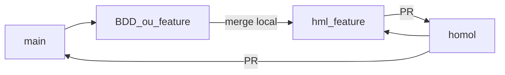

# Kigen Shinobi

Documentação do fluxo oficial de desenvolvimento, revisão de código e integração entre ambientes.

## Ambientes e branches

| Branch | Ambiente | Descrição |
|--------|----------|-----------|
| `main` | Produção | Código estável em produção. |
| `homol` | Homologação | Código validado para testes de homologação. |
| `<prefixo>-*` | Desenvolvimento | Branch de funcionalidade (ex.: `BDD-1`, `FEAT-12`). |
| `hml-<prefixo>-*` | PR para homologação | Branch intermediária usada exclusivamente para abrir PR em `homol` (ex.: `hml-BDD-1`). |

O prefixo `BDD` é um exemplo. Outros prefixos (ex.: `FEAT`, `FIX`, `HOTFIX`) também são válidos, desde que o par feature / homologação use o mesmo identificador (`FEAT-12` → `hml-FEAT-12`).

## Fluxo oficial

```text
main → <prefixo>-* → hml-<prefixo>-* → PR → homol → PR → main
```

### Passo a passo

1. Atualizar a `main` localmente.
2. Criar a branch de desenvolvimento a partir da `main` (ex.: `BDD-1`).
3. Desenvolver a funcionalidade na branch de desenvolvimento.
4. Criar a branch de homologação a partir da `homol` (ex.: `hml-BDD-1`).
5. Mesclar a branch de desenvolvimento na branch `hml-*`.
6. Abrir **Pull Request** de `hml-*` → `homol`.
7. Após validação em homologação, abrir **Pull Request** de `homol` → `main`.

### Exemplo de comandos

```bash
# 1–2. Atualizar main e criar feature
git checkout main
git pull origin main
git checkout -b BDD-1

# ... desenvolver e commit ...

# 4. Criar branch de PR para homologação a partir de homol
git checkout homol
git pull origin homol
git checkout -b hml-BDD-1

# 5. Trazer a feature para a branch de homologação
git merge BDD-1

# 6. Publicar e abrir PR para homol
git push -u origin hml-BDD-1
gh pr create --base homol --head hml-BDD-1 --title "BDD-1: descrição" --body "..."

# 7. Após validação, abrir PR de homol para main
gh pr create --base main --head homol --title "Release: homologação → produção" --body "..."
```



## Regras de Pull Request

- Atualizações em `main` e `homol` devem ocorrer **somente via Pull Request**.
- Evitar push direto em `main` e `homol`.
- A branch de desenvolvimento (`BDD-*` ou outro prefixo) **nunca** deve ser mesclada diretamente em `homol`.
- Sempre criar `hml-<prefixo>-*` a partir de `homol`, mesclar a feature nela e abrir o PR `hml-*` → `homol`.
- Após homologação aprovada, o caminho para produção é PR `homol` → `main`.

## Critérios de aceite (processo)

- [x] Branches `main` e `homol` criadas.
- [x] Padrão de nomenclatura definido.
- [x] Fluxo documentado neste README.

## Pipeline de CI

Toda Pull Request com destino `homol` ou `main` executa o workflow [`.github/workflows/ci.yml`](.github/workflows/ci.yml):

1. **Lint** — `npm run lint`
2. **Type Check** — `npm run typecheck`
3. **Build** — `npm run build` (gera configs a partir das env vars e valida artefatos)

### Bloquear merge se a CI falhar

No GitHub (conta com permissão admin):

1. Settings → Branches → Add/Edit branch ruleset (ou Branch protection) para `main` e `homol`
2. Exigir status checks antes do merge
3. Marcar o check **Lint, Type Check and Build** (job do workflow `CI`)

Sem esse required check, a pipeline ainda roda nas PRs, mas o merge não fica bloqueado automaticamente.

## Deploy automático (Vercel)

| Branch | Ambiente Vercel | Comportamento |
|--------|-----------------|---------------|
| `main` | **Production** | Deploy automático em produção |
| `homol` | **Preview** (homologação) | Deploy automático de homologação — **não** sobe para produção |

### Configuração no painel Vercel

1. Importar o repositório `andertechn/kigen_shinobi` (ou confirmar o projeto já vinculado).
2. **Settings → Git**:
   - Production Branch = `main`
   - Deixar deploys habilitados para `homol` (Preview)
3. Confirmar que merges em `homol` geram apenas Preview (nunca Production).
4. (Opcional) Atribuir um domínio de homologação ao branch `homol` em **Deployments → … → Assign Domain**.

O [`vercel.json`](vercel.json) usa `npm ci` + `npm run build` e publica a raiz do site estático.

## Variáveis de ambiente

Modelo em [`.env.example`](.env.example).

| Variável | Onde | Production (`main`) | Preview / Homol (`homol`) | Observação |
|----------|------|---------------------|---------------------------|------------|
| `SUPABASE_URL` | Vercel + local | URL do projeto prod | URL do projeto homol (ou o mesmo, se ainda compartilhado) | Pública no browser |
| `SUPABASE_ANON_KEY` | Vercel + local | Anon key prod | Anon key homol | Pública no browser (RLS) |
| `SWIFT_API_URL` | Vercel + local | Edge Function prod | Edge Function homol | Opcional; default deriva de `SUPABASE_URL` |
| `APPS_SCRIPT_URL` | Vercel + local | Script prod | Script homol | Opcional |
| `SUPABASE_SERVICE_ROLE_KEY` | **Só Supabase Secrets** | Secret da Edge Function | Secret da Edge Function | Nunca no frontend / Vercel client |

### Como configurar na Vercel

1. Project → **Settings → Environment Variables**
2. Cadastre cada variável duas vezes (ou com escopos distintos):
   - **Production** → valores de produção (`main`)
   - **Preview** → valores de homologação (`homol` e demais previews)
3. Faça um redeploy após alterar secrets.

No build, [`scripts/generate-config.mjs`](scripts/generate-config.mjs) grava `config.js` e `shared/config.js` com esses valores.

### Secrets do GitHub Actions (opcional)

Para a CI usar os mesmos valores do ambiente (em vez do fallback local):

Repository → Settings → Secrets and variables → Actions:

- `SUPABASE_URL`
- `SUPABASE_ANON_KEY`
- `SWIFT_API_URL` (opcional)
- `APPS_SCRIPT_URL` (opcional)
