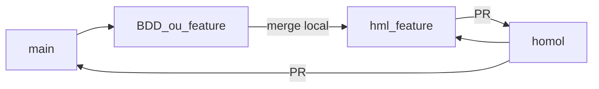

# Kigen Shinobi

Documentação do fluxo oficial de desenvolvimento, revisão de código e integração entre ambientes.

## Ambientes e branches

| Branch | Ambiente | Descrição |
|--------|----------|-----------|
| `main` | Produção | Código estável em produção. |
| `homol` | Homologação | Código validado para testes de homologação. |
| `<prefixo>-*` | Desenvolvimento | Branch de funcionalidade (ex.: `BDD-1`, `FEAT-12`). |
| `hml-<prefixo>-*` | PR para homologação | Branch intermediária usada exclusivamente para abrir PR em `homol` (ex.: `hml-BDD-1`). |

O prefixo `BDD` é um exemplo. Outros prefixos (ex.: `FEAT`, `FIX`, `HOTFIX`) também são válidos, desde que o par feature / homologação use o mesmo identificador (`FEAT-12` → `hml-FEAT-12`).

## Fluxo oficial

```text
main → <prefixo>-* → hml-<prefixo>-* → PR → homol → PR → main
```

### Passo a passo

1. Atualizar a `main` localmente.
2. Criar a branch de desenvolvimento a partir da `main` (ex.: `BDD-1`).
3. Desenvolver a funcionalidade na branch de desenvolvimento.
4. Criar a branch de homologação a partir da `homol` (ex.: `hml-BDD-1`).
5. Mesclar a branch de desenvolvimento na branch `hml-*`.
6. Abrir **Pull Request** de `hml-*` → `homol`.
7. Após validação em homologação, abrir **Pull Request** de `homol` → `main`.

### Exemplo de comandos

```bash
# 1–2. Atualizar main e criar feature
git checkout main
git pull origin main
git checkout -b BDD-1

# ... desenvolver e commit ...

# 4. Criar branch de PR para homologação a partir de homol
git checkout homol
git pull origin homol
git checkout -b hml-BDD-1

# 5. Trazer a feature para a branch de homologação
git merge BDD-1

# 6. Publicar e abrir PR para homol
git push -u origin hml-BDD-1
gh pr create --base homol --head hml-BDD-1 --title "BDD-1: descrição" --body "..."

# 7. Após validação, abrir PR de homol para main
gh pr create --base main --head homol --title "Release: homologação → produção" --body "..."
```



## Regras de Pull Request

- Atualizações em `main` e `homol` devem ocorrer **somente via Pull Request**.
- Evitar push direto em `main` e `homol`.
- A branch de desenvolvimento (`BDD-*` ou outro prefixo) **nunca** deve ser mesclada diretamente em `homol`.
- Sempre criar `hml-<prefixo>-*` a partir de `homol`, mesclar a feature nela e abrir o PR `hml-*` → `homol`.
- Após homologação aprovada, o caminho para produção é PR `homol` → `main`.

## Critérios de aceite (processo)

- [x] Branches `main` e `homol` criadas.
- [x] Padrão de nomenclatura definido.
- [x] Fluxo documentado neste README.
